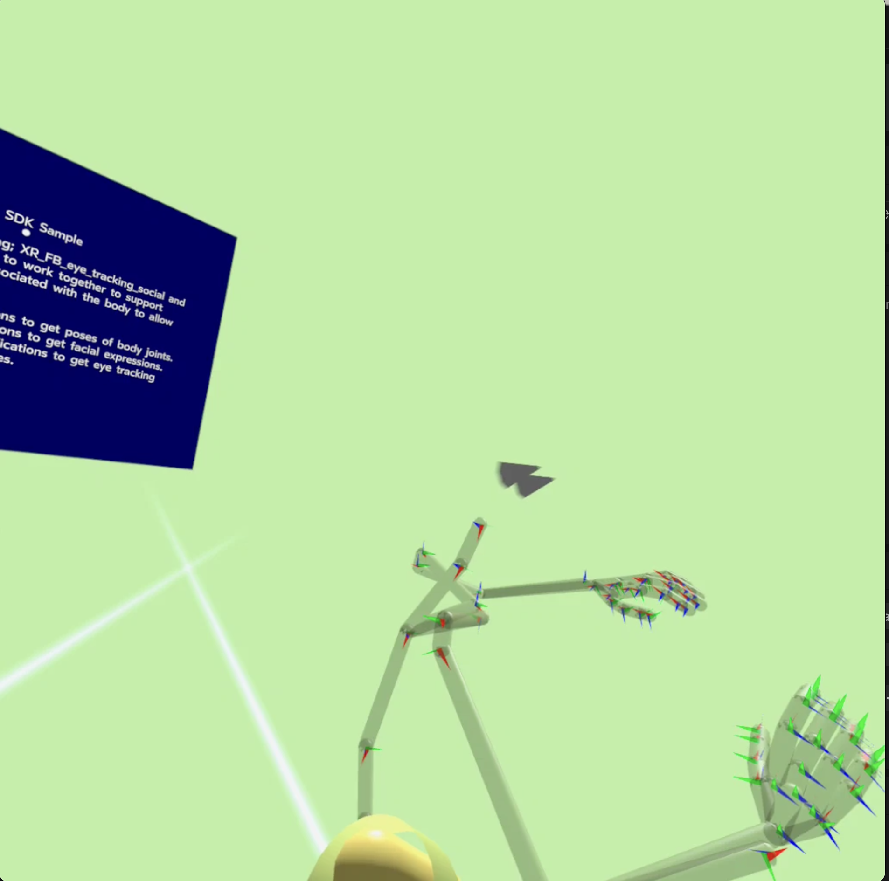

# OpenXR Body, Face, Eye Social Sample

## Overview
The extensions XR_FB_body_tracking, XR_FB_eye_tracking_social, and XR_FB_face_tracking2 are designed to work together to support querying devices for information associated with the body, allowing the rendering of a user's avatar.

XR_FB_body_tracking allows applications to get poses of body joints. XR_FB_face_tracking2 enables applications to capture facial expressions. XR_FB_eye_tracking_social provides applications with eye-tracking information for social/avatar use cases.

## The Sample
This sample demonstrates how Body Tracking, Eye Tracking, and Face Tracking work together.
 The two cones point to the direction the eyes are looking at. The skeleton shows the tracked body movement.
Expressions are detected and displayed in the text box, which defaults to "neutral expression".
