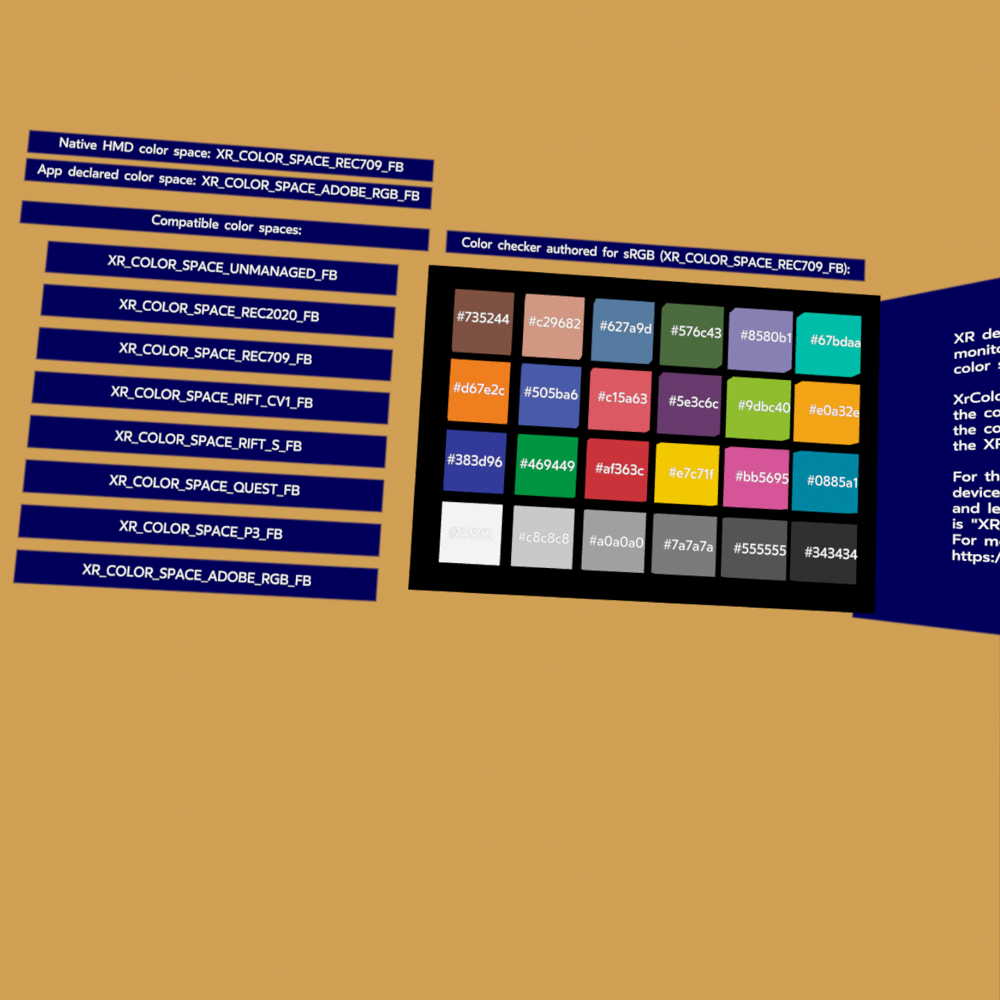

# OpenXR Color Space Sample

## Overview
XR devices may use a color space that differs from many monitors used in development. Application developers might want to specify the color space in which they have authored their application, so the appropriate colors are displayed when the application runs on the XR device.

The extension `XR_FB_color_space` is designed to allow:
* An application to get the native color space of the XR device.
* An application to enumerate the supported color spaces for the session.
* An application to set the color space for the session.

## What is Color Space?
Color space refers to the range of colors that a device can represent and display. It's a specific organization of colors within a three-dimensional space, which allows for the accurate representation and communication of digital colors.

For more details and recommendations on color management, see: https://developer.oculus.com/resources/color-management-guide/

## The Sample
You can select a color space from the provided list and observe the difference on the color checker.

