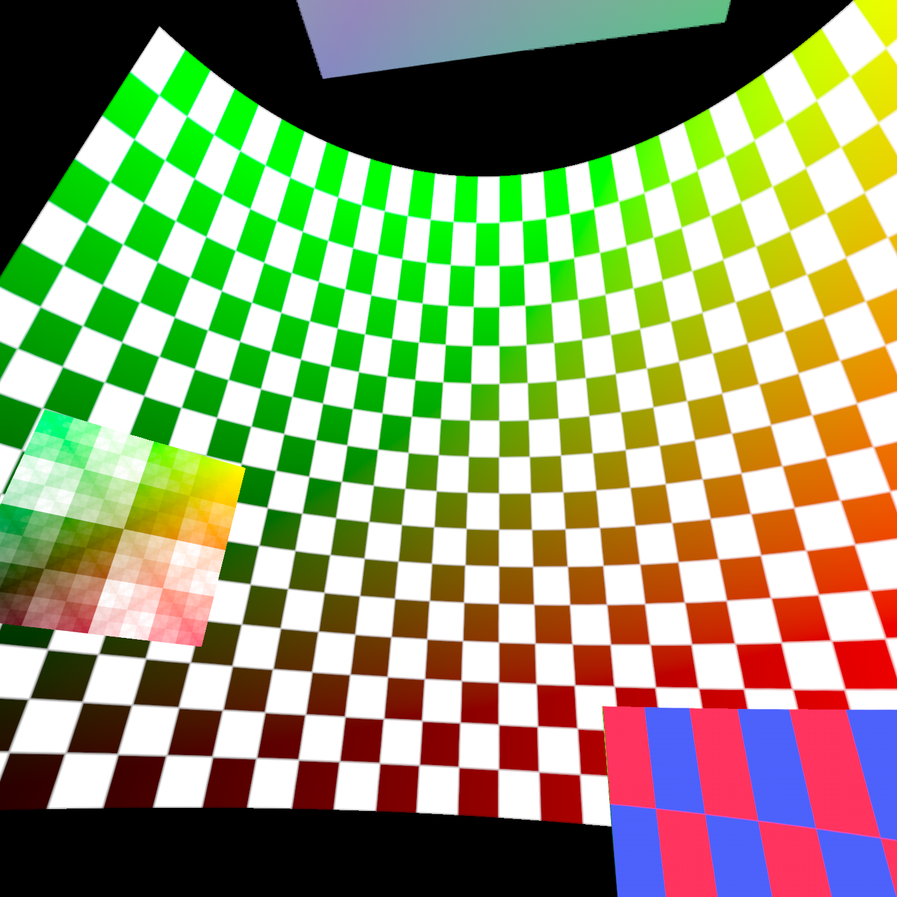

# OpenXR Compositor Sample

## Overview
The extensions: `XR_KHR_composition_layer_cube`, `XR_KHR_composition_layer_cylinder`, and `XR_KHR_composition_layer_equirect2` add additional layer types that allow mapping textures from swapchains onto various types of surfaces.

* `XR_KHR_composition_layer_cube` adds an additional layer type that enables direct sampling from cubemaps.
* `XR_KHR_composition_layer_cylinder` adds an additional layer type that enables mapping a texture stemming from a swapchain onto the inside of a cylinder section.
* `XR_KHR_composition_layer_equirect2` adds an additional layer type that enables mapping an equirectangular coded image stemming from a swapchain onto the inside of a sphere.

## The Sample
The sample is a single `C` file that shows how to create a native app using OpenXR from beginning to end. The sample also demonstrates how to create multiple layers and compose them all together with the compositor in a depth-consistent order.

