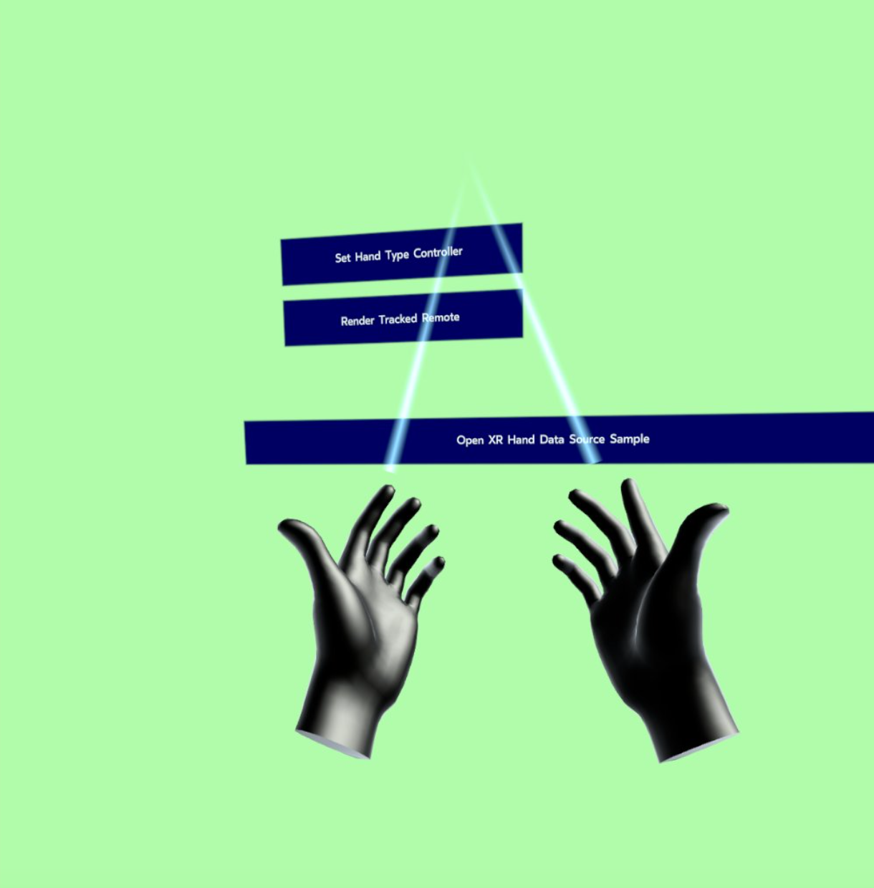

# OpenXR Hybrid Hands Sample

## Overview
The `XR_EXT_hand_tracking_data_source` extension augments the `XR_EXT_hand_tracking` extension. Runtimes may support a variety of data sources for hand joint data for `XR_EXT_hand_tracking`, and some runtimes and devices may use joint data from multiple sources. This app showcases hybrid hands functionality, which can derive hand joint data poses from controller data.

## The Sample
There are two buttons in the sample:
* The top one controls whether we present the hands as wrapped around the controller, or if we present them in a natural state. The application starts in the state where hands are wrapped around the controller.
* The one below that controls whether we render the controller model or not. In a real scenario, the developer would usually render the controller model in the controller-wrapped state and not in the natural state. The application starts with the controller rendering turned off.

#### main.cpp
Main logic of the sample, handles responding to button presses and setting up the scene.

#### xr_hand_helper.h
Helper class to handle the OpenXR logic of hand tracking.

## Enabling Hybrid Hands
When a hand tracker is created it is passed a `XrHandTrackingDataSourceEXT` array parameter.
`XR_HAND_TRACKING_DATA_SOURCE_UNOBSTRUCTED` means the runtime can return hand poses generated by cameras.
`XR_HAND_TRACKING_DATA_SOURCE_CONTROLLER_EXT` means the runtime can return hand poses generated by controller data.

## Natural vs Controller
The xrHandJointsLocateInfoEXT has a parameter for `handJointsMotionRange`.
`XR_HANDS_JOINTS_MOTION_RANGE_UNOBSTRUCTED_EXT` is for natural poses.
`XR_HAND_JOINTS_MOTION_RANGE_CONFORMING_TO_CONTROLLER_EXT` is for hands wrapped around the controller.

## Note
When the hand skeleton is in Natural Mode, in order for a pinch to register the thumb has to be down on the controller as well as the index trigger pulled.
