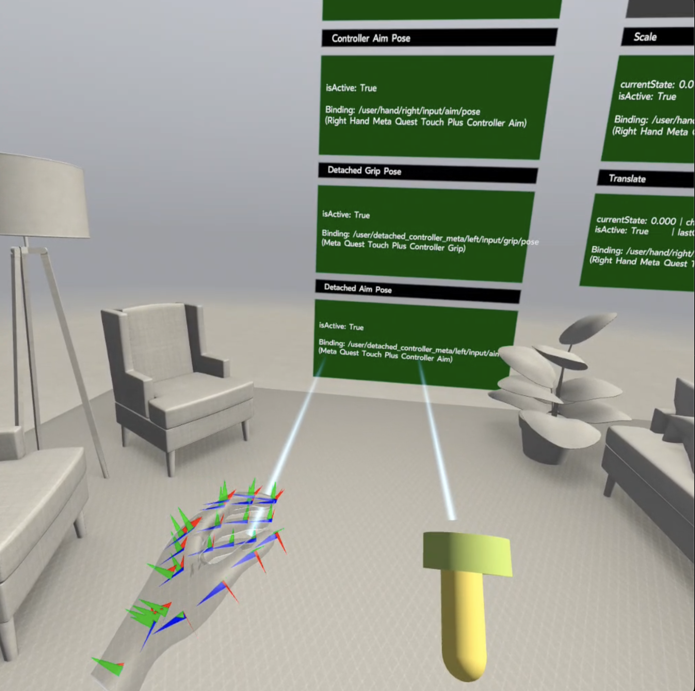

# OpenXR Simultaneous Hands and Controllers Sample

## Overview
Meta Quest devices have the ability to track both hands and controllers simultaneously (commonly referred to as multimodal hands and controllers input). However, this may consume additional power and system resources. The extensions `XR_META_detached_controllers` and `XR_META_simultaneous_hands_and_controllers` work together in this sample to allow hands and controllers to be tracked simultaneously.

The `XR_META_simultaneous_hands_and_controllers` extension enables concurrent hand and controller tracking at the same time. It exposes two APIs that allow app developers to enable and disable this functionality at will. Enabling the feature will give developers a new input model to build experiences with; hands and controller data will now flow concurrently into the appropriate top-level paths depending on whether controllers are held or not. Disabling the feature returns to the traditional world of hands-only and controllers-only experiences, and can also save on compute.

The `XR_META_detached_controllers` extension augments the `XR_META_simultaneous_hands_and_controllers` extension; enabling the extension opens up two new top level paths that are populated with controller data (either left or right, as appropriate) when controllers are unheld. The app developer can choose to ignore this feature or render/use the unheld controller data to build further app experiences.

Both are demonstrated in this sample.

## Supported Devices
* Mobile
    * Quest Pro + Quest Touch Pro Controller
    * Quest 2 + Quest Touch Controller
    * Quest 2 + Quest Touch Pro Controller
    * Quest 3 + Quest Touch Plus Controller
    * Quest 3 + Quest Touch Pro Controller
* PC
    * Quest Pro + Quest Touch Pro Controller
    * Quest 2 + Quest Touch Controller
    * Quest 2 + Quest Touch Pro Controller
    * Quest 3 + Quest Touch Plus Controller
    * Quest 3 + Quest Touch Pro Controller

## The Sample
There are six buttons in the sample:
* A "Click me!" button exists to demonstrate that the UI can be interacted with via either hand or controller when holding one controller and using an empty tracked hand together. Try only holding one controller and clicking/pinching the button from each hand to demonstrate this.
* One further button allows the user to enable and disable the concurrent tracking of hands and controllers. This simply calls the associated APIs which is observable in the sample's code. Clicking this allows the developer to explore the input behavior when the feature is enabled and disabled in real time.
* The next four buttons demonstrate sending haptic feedback to controllers that are either held or not held. This demonstrates the APIs used to take advantage of these two features in combination.

#### main.cpp
Main logic of the sample. It handles responding to button presses, setting up the scene, and demonstrates the real-time population of interaction profiles and action paths to help developers understand the behavior in real time.

#### SkyboxRenderer.h, SkyboxRenderer.cpp
Helper class to handle the rendering of the skybox.

#### EnvironmentRenderer.h, EnvironmentRenderer.cpp
Helper class to handle the rendering of the environment.

#### ActionSetDisplayPanel.h, ActionSetDisplayPanel.cpp
Helper class to handle the logic of displaying action set population UI for easy real-time understanding.
