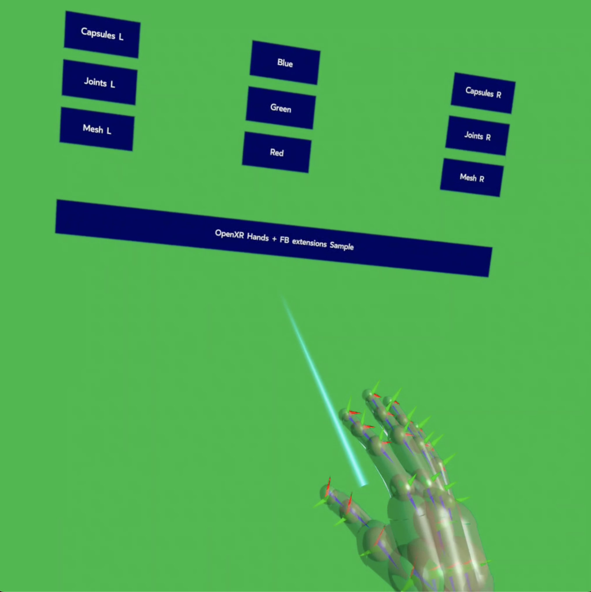

# OpenXR Hands Tracking Sample

## Overview
The extensions `XR_EXT_hand_tracking`, `XR_FB_hand_tracking_mesh`, `XR_FB_hand_tracking_capsules`, and `XR_FB_hand_tracking_aim` work together to allow applications to interact with the hand tracking functionality of the device.

* `XR_EXT_hand_tracking` provides a list of hand joint poses.
* `XR_FB_hand_tracking_mesh` allows an application to get a skinned hand mesh and a bind pose skeleton that can be used to render a hand object driven by the joints from the XR_EXT_hand_tracking extension.
* `XR_FB_hand_tracking_capsules` allows an application to get a list of capsules that represent the volume of the hand when using the XR_EXT_hand_tracking extension.
* `XR_FB_hand_tracking_aim` allows an application to get a set of basic gesture states for the hand when using the XR_EXT_hand_tracking extension.

## The Sample
In this sample, the user is able to toggle between mesh, capsules, and joints on the hand model by selecting a button using a gesture with hand tracking.

