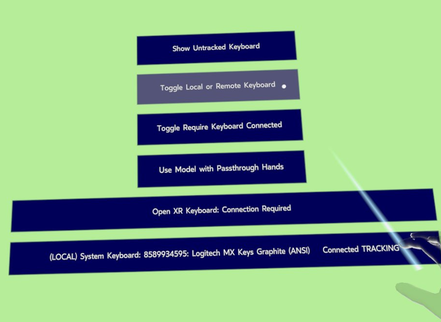
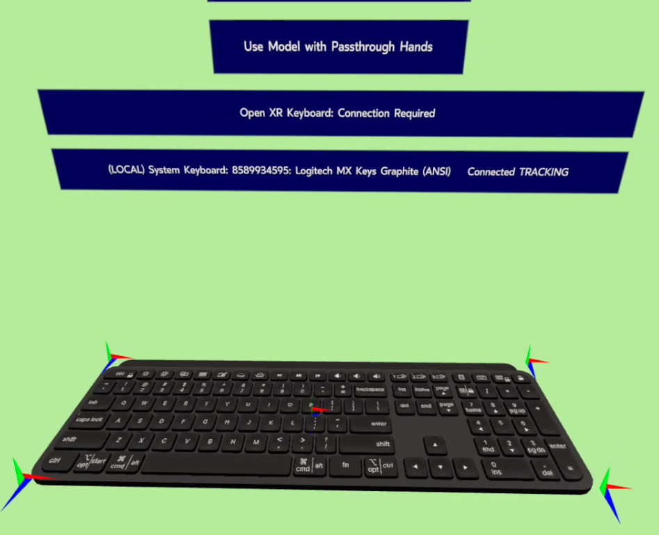
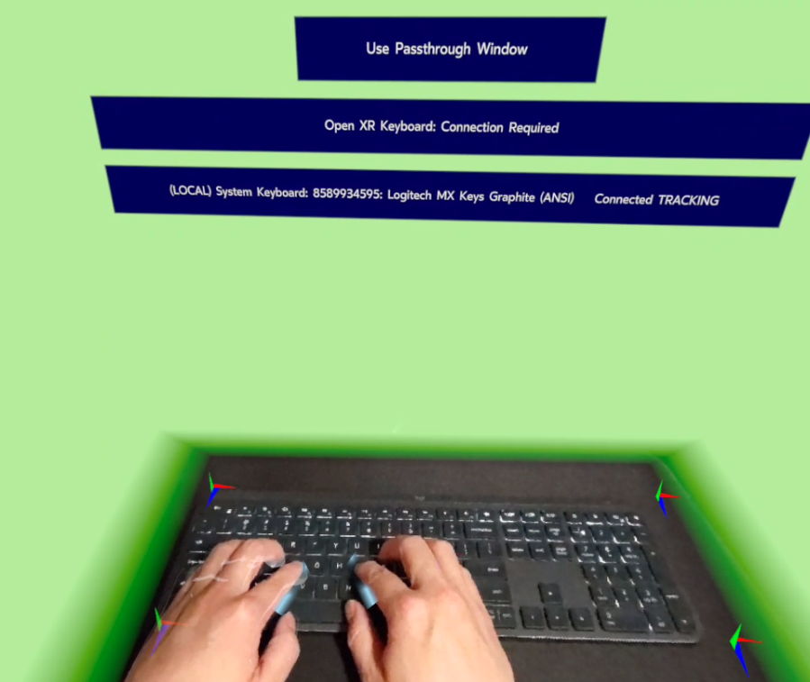
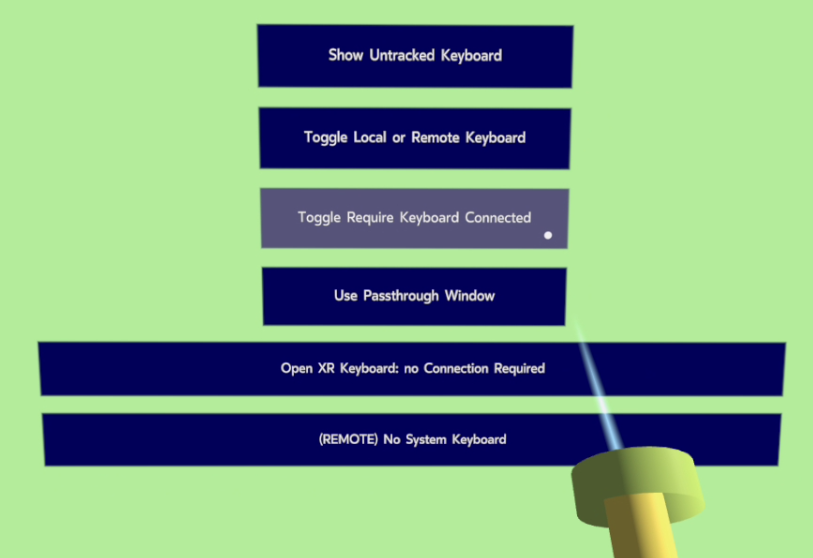

# Physical Keyboard Tracking Sample

There are several components that you must set up to provide users with a rich tracked keyboard experience. These components are:

* Tracked Keyboard
* Hands
* Passthrough

The Tracked Keyboard is the keyboard itself in virtual space. This component looks for a keyboard in physical space and tries to match it with the user's selected keyboard. If the component tracks a physical keyboard, it will render it in virtual space.

The Hands component assists in tracking and displaying hand models in virtual space that correspond to the user's actual hands.

[Passthrough](https://developer.oculus.com/documentation/native/android/mobile-passthrough/) allows for the user's real hands to be seen in virtual space using passthrough camera layers. When the hands are not near the keyboard, they are rendered as a VR model. When the hands are near the keyboard, rendering switches to using Passthrough mode, which displays the user's actual hands to the user.

For the complete API reference as part of the OpenXR spec, read [`XR_FB_keyboard_tracking`](https://registry.khronos.org/OpenXR/specs/1.1/html/xrspec.html#XR_FB_keyboard_tracking).

## Prerequisites

Before you begin working with the tracked keyboard, you need the following:

* An Oculus Quest 2, Quest Pro, or Quest 3 headset with the latest Oculus software.
* One of the keyboards listed on the [Tracked Keyboards for Meta Quest 2](https://www.meta.com/help/quest/articles/headsets-and-accessories/meta-quest-accessories/tracked-keyboards-meta-quest/) support page.

Make sure to use the latest version of the Meta Quest operating system. To verify this, do the following:

1. In the headset, go to **Settings** > **System** > **Software Update**.
1. Check the version.
1. If the version is not 37 or higher, update the software to the latest available version.

## Android Setup

The `AndroidManifest.xml` file requires the following features and permissions to use physically tracked keyboards.

```
<!-- Tell the system this app can render passthrough -->
<uses-feature android:name="com.oculus.feature.PASSTHROUGH" android:required="true" />
<!-- Tell the system this app uses render model extensions -->
<uses-feature android:name="com.oculus.feature.RENDER_MODEL" android:required="true" />
<uses-permission android:name="com.oculus.permission.RENDER_MODEL" />
<!-- Tell the system this app can handle tracked keyboards -->
<uses-feature android:name="oculus.software.trackedkeyboard" android:required="false" />
<uses-permission android:name="com.oculus.permission.TRACKED_KEYBOARD" />
```

## Native Integration

### Extensions

The following extensions are required for using the physical keyboard tracking functionality:

* Keyboard Tracking:
    * `XR_FB_KEYBOARD_TRACKING_EXTENSION_NAME`
* Dynamic Render Model:
    * `XR_FB_RENDER_MODEL_EXTENSION_NAME`
* Passthrough Hands:
    * `XR_FB_PASSTHROUGH_KEYBOARD_HANDS_EXTENSION_NAME`
    * `XR_FB_PASSTHROUGH_EXTENSION_NAME`
    * `XR_FB_TRIANGLE_MESH_EXTENSION_NAME`
* Hands:
    * `XR_EXT_HAND_TRACKING_EXTENSION_NAME`
    * `XR_FB_HAND_TRACKING_MESH_EXTENSION_NAME`
    * `XR_FB_HAND_TRACKING_AIM_EXTENSION_NAME`
* Compositor Layer blending:
    * `XR_FB_COMPOSITION_LAYER_ALPHA_BLEND_EXTENSION_NAME`

Our sample exposes these extensions by overriding the `GetExtensions` method of `XrApp` and returning the result to ensure the required extensions are returned when needed.

```
// Returns a list of OpenXr extensions needed for this app
virtual std::vector<const char*> GetExtensions() override {
    std::vector<const char*> extensions = XrApp::GetExtensions();
    extensions.push_back(XR_FB_KEYBOARD_TRACKING_EXTENSION_NAME);
    extensions.push_back(XR_FB_RENDER_MODEL_EXTENSION_NAME);
    extensions.push_back(XR_FB_PASSTHROUGH_KEYBOARD_HANDS_EXTENSION_NAME);
    extensions.push_back(XR_FB_PASSTHROUGH_EXTENSION_NAME);
    extensions.push_back(XR_FB_TRIANGLE_MESH_EXTENSION_NAME);
    extensions.push_back(XR_EXT_HAND_TRACKING_EXTENSION_NAME);
    extensions.push_back(XR_FB_HAND_TRACKING_MESH_EXTENSION_NAME);
    extensions.push_back(XR_FB_HAND_TRACKING_AIM_EXTENSION_ANEM);
    extensions.push_back(XR_FB_COMPOSITION_LAYER_ALPHA_BLEND_EXTENSION_NAME);
    extensions.push_back(kbdExtension);
    return extensions;
}
```

### Initialization

Call to OpenXR to query the component extensions function pointers by using the `XrInstance`:

```
oxr(xrGetInstanceProcAddr(
    instance,
    "xrQuerySystemTrackedKeyboardFB",
    (PFN_xrVoidFunction*)(&xrQuerySystemTrackedKeyboardFB_)));
oxr(xrGetInstanceProcAddr(
    instance,
    "xrCreateKeyboardSpaceFB",
    (PFN_xrVoidFunction*)(&xrCreateKeyboardSpaceFB_)));
```

Similarly, to allow users to see their hands through passthrough when using a tracked keyboard. For example:

```
/// passthrough
oxr(xrGetInstanceProcAddr(
    instance, "xrCreatePassthroughFB", (PFN_xrVoidFunction*)(&xrCreatePassthroughFB_)));
oxr(xrGetInstanceProcAddr(
    instance, "xrDestroyPassthroughFB", (PFN_xrVoidFunction*)(&xrDestroyPassthroughFB_)));
oxr(xrGetInstanceProcAddr(
    instance, "xrPassthroughStartFB", (PFN_xrVoidFunction*)(&xrPassthroughStartFB_)));
oxr(xrGetInstanceProcAddr(
    instance, "xrPassthroughPauseFB", (PFN_xrVoidFunction*)(&xrPassthroughPauseFB_)));
/// layer
oxr(xrGetInstanceProcAddr(
    instance,
    "xrCreatePassthroughLayerFB",
    (PFN_xrVoidFunction*)(&xrCreatePassthroughLayerFB_)));
oxr(xrGetInstanceProcAddr(
    instance,
    "xrDestroyPassthroughLayerFB",
    (PFN_xrVoidFunction*)(&xrDestroyPassthroughLayerFB_)));
oxr(xrGetInstanceProcAddr(
    instance,
    "xrPassthroughLayerPauseFB",
    (PFN_xrVoidFunction*)(&xrPassthroughLayerPauseFB_)));
oxr(xrGetInstanceProcAddr(
    instance,
    "xrPassthroughLayerResumeFB",
    (PFN_xrVoidFunction*)(&xrPassthroughLayerResumeFB_)));
/// style
oxr(xrGetInstanceProcAddr(
    instance,
    "xrPassthroughLayerSetStyleFB",
    (PFN_xrVoidFunction*)(&xrPassthroughLayerSetStyleFB_)));
/// geometry
oxr(xrGetInstanceProcAddr(
    instance,
    "xrCreateGeometryInstanceFB",
    (PFN_xrVoidFunction*)(&xrCreateGeometryInstanceFB_)));
oxr(xrGetInstanceProcAddr(
    instance,
    "xrDestroyGeometryInstanceFB",
    (PFN_xrVoidFunction*)(&xrDestroyGeometryInstanceFB_)));
oxr(xrGetInstanceProcAddr(
    instance,
    "xrGeometryInstanceSetTransformFB",
    (PFN_xrVoidFunction*)(&xrGeometryInstanceSetTransformFB_)));
/// Passthrough - keyboard hands function
oxr(xrGetInstanceProcAddr(
    instance, "xrPassthroughLayerSetKeyboardHandsIntensityFB", (PFN_xrVoidFunction*)(&xrPassthroughLayerSetKeyboardHandsIntensityFB_)));
/// Passthrough - mesh extension functions
/// mesh
oxr(xrGetInstanceProcAddr(
    instance, "xrCreateTriangleMeshFB", (PFN_xrVoidFunction*)(&xrCreateTriangleMeshFB_)));
oxr(xrGetInstanceProcAddr(
    instance, "xrDestroyTriangleMeshFB", (PFN_xrVoidFunction*)(&xrDestroyTriangleMeshFB_)));
/// buffers
oxr(xrGetInstanceProcAddr(
    instance,
    "xrTriangleMeshGetVertexBufferFB",
    (PFN_xrVoidFunction*)(&xrTriangleMeshGetVertexBufferFB_)));
oxr(xrGetInstanceProcAddr(
    instance,
    "xrTriangleMeshGetIndexBufferFB",
    (PFN_xrVoidFunction*)(&xrTriangleMeshGetIndexBufferFB_)));
/// update
oxr(xrGetInstanceProcAddr(
    instance,
    "xrTriangleMeshBeginUpdateFB",
    (PFN_xrVoidFunction*)(&xrTriangleMeshBeginUpdateFB_)));
oxr(xrGetInstanceProcAddr(
    instance,
    "xrTriangleMeshEndUpdateFB",
    (PFN_xrVoidFunction*)(&xrTriangleMeshEndUpdateFB_)));
oxr(xrGetInstanceProcAddr(
    instance,
    "xrTriangleMeshBeginVertexBufferUpdateFB",
    (PFN_xrVoidFunction*)(&xrTriangleMeshBeginVertexBufferUpdateFB_)));
oxr(xrGetInstanceProcAddr(
    instance,
    "xrTriangleMeshEndVertexBufferUpdateFB",
    (PFN_xrVoidFunction*)(&xrTriangleMeshEndVertexBufferUpdateFB_)));
```

Similarly, for Hands, follow this way:

```
/// Hook up extensions for hand tracking
oxr(xrGetInstanceProcAddr(
    instance, "xrCreateHandTrackerEXT", (PFN_xrVoidFunction*)(&xrCreateHandTrackerEXT_)));
oxr(xrGetInstanceProcAddr(
    instance, "xrDestroyHandTrackerEXT", (PFN_xrVoidFunction*)(&xrDestroyHandTrackerEXT_)));
oxr(xrGetInstanceProcAddr(
    instance, "xrLocateHandJointsEXT", (PFN_xrVoidFunction*)(&xrLocateHandJointsEXT_)));
/// Hook up extensions for hand rendering
oxr(xrGetInstanceProcAddr(
    instance, "xrGetHandMeshFB", (PFN_xrVoidFunction*)(&xrGetHandMeshFB_)));
```

Finally, add the extension functions for render model:

```
/// Hook up extensions for device settings
oxr(xrGetInstanceProcAddr(
    instance,
    "xrEnumerateRenderModelPathsFB",
    (PFN_xrVoidFunction*)(&xrEnumerateRenderModelPathsFB_)));
oxr(xrGetInstanceProcAddr(
    instance,
    "xrGetRenderModelPropertiesFB",
    (PFN_xrVoidFunction*)(&xrGetRenderModelPropertiesFB_)));
oxr(xrGetInstanceProcAddr(
    instance, "xrLoadRenderModelFB", (PFN_xrVoidFunction*)(&xrLoadRenderModelFB_)));
```

### Query System for Keyboard Tracking Info

To receive tracked keyboard information so that you update your keyboard model, you must query the system. This will inform you if a keyboard exists and, if so, whether it can be tracked. Later on, you will also be able to query for updated state values of the keyboard.

```
if (xrQuerySystemTrackedKeyboardFB_) {
    // current query
    {
        XrKeyboardTrackingQueryFB queryInfo{XR_TYPE_KEYBOARD_TRACKING_QUERY_FB};
        queryInfo.flags = XR_KEYBOARD_TRACKING_QUERY_LOCAL_BIT_FB;
        XrKeyboardTrackingDescriptionFB desc;
        if (oxr(xrQuerySystemTrackedKeyboardFB_(session_, &queryInfo, &desc))) {
            if ((desc.flags & XR_KEYBOARD_TRACKING_EXISTS_BIT_FB) != 0) {
                // found keyboard
                if (!systemKeyboardExists_ ||
                    systemKeyboardDesc_.trackedKeyboardId != desc.trackedKeyboardId ||
                    systemKeyboardDesc_.flags != desc.flags) {
                    ALOG(
                        "Found new system keyboard '%d' '%s'",
                        desc.trackedKeyboardId,
                        desc.name);
                    systemKeyboardExists_ = true;
                    systemKeyboardDesc_ = desc;
                    systemKeyboardConnected_ =
                        systemKeyboardDesc_.flags & XR_KEYBOARD_TRACKING_CONNECTED_BIT_FB;
                    if ((systemKeyboardDesc_.flags & XR_KEYBOARD_TRACKING_LOCAL_BIT_FB)) {
                        trackingSystemKeyboard_ = false;
                        if (trackSystemKeyboard_) {
                            if (systemKeyboardConnected_ ||
                                !requireKeyboardConnectedToTrack_) {
                                if (StartTrackingSystemKeyboard()) {
                                    trackingSystemKeyboard_ = true;
                                }
                            }
                        }
                        if (!trackingSystemKeyboard_) {
                            StopTracking();
                        }
                    } else {
                        ALOG(
                            "Found new system keyboard '%d' '%s', but not tracking because it isn't local",
                            desc.trackedKeyboardId,
                            desc.name);
                    }

                    systemKeyboardStateChanged_ = true;
                }
            } else {
                // no keyboard
                if (systemKeyboardExists_) {
                    systemKeyboardExists_ = false;
                    if (trackSystemKeyboard_) {
                        StopTracking();
                        trackingSystemKeyboard_ = false;
                    }
                    systemKeyboardStateChanged_ = true;
                }
            }
        }
    }
}

if (keyboardSpace_ != XR_NULL_HANDLE) {
    location_.next = nullptr;
    return oxr(
        xrLocateSpace(keyboardSpace_, currentSpace, predictedDisplayTime, &location_));
}
```

### Start and Stop Tracking

The following code is an example of how you can tell the system to start and stop keyboard tracking.

```
bool StartTrackingSystemKeyboard() {
    /// delete old ...
    StopTracking();

    if (xrCreateKeyboardSpaceFB_ && systemKeyboardExists_) {
        XrKeyboardSpaceCreateInfoFB createInfo{XR_TYPE_KEYBOARD_SPACE_CREATE_INFO_FB};
        createInfo.trackedKeyboardId = systemKeyboardDesc_.trackedKeyboardId;
        if (XR_SUCCEEDED(
                oxr(xrCreateKeyboardSpaceFB_(session_, &createInfo, &keyboardSpace_)))) {
            size_ = systemKeyboardDesc_.size;
            return true;
        }
    }

    return false;
}

bool StopTracking() {
    bool result = false;
    if (keyboardSpace_ != XR_NULL_HANDLE) {
        result = oxr(xrDestroySpace(keyboardSpace_));
        if (result) {
            keyboardSpace_ = XR_NULL_HANDLE;
        } else {
            ALOG("Failed to destroy keyboardSpace_ %p", keyboardSpace_);
        }
    }
    return result;
}
```

### Loading Keyboard Render Model

To load the keyboard render model, you must first enumerate all available render model paths. This involves making a few calls to retrieve the paths and their properties as shown in the example below.

`XR_TYPE_RENDER_MODEL_PROPERTIES_FB` is a struct definition that will be populated with the method [`xrGetRenderModelPropertiesFB_`](https://www.khronos.org/registry/OpenXR/specs/1.1/html/xrspec.html#xrGetRenderModelPropertiesFB).

```
/// Enumerate available models
XrInstance instance = GetInstance();
if (xrEnumerateRenderModelPathsFB_) {
    /// Query path count
    uint32_t pathCount = 0;
    oxr(xrEnumerateRenderModelPathsFB_(session_, pathCount, &pathCount, nullptr));
    if (pathCount > 0) {
        XRLOG("XrRenderModelHelper: found %u models ", pathCount);
        paths_.resize(pathCount);
        /// Fill in the path data
        oxr(xrEnumerateRenderModelPathsFB_(session_, pathCount, &pathCount, &paths_[0]));
        /// Get properties
        for (const auto& p : paths_) {
            XrRenderModelPropertiesFB prop{XR_TYPE_RENDER_MODEL_PROPERTIES_FB};
            XrResult result = xrGetRenderModelPropertiesFB_(session_, p.path, &prop);
            if (result == XR_SUCCESS) {
                properties_.push_back(prop);
            }
        }
    }
}
```

Once the paths are discovered, you can query the keyboard render model(s). First, execute a two-call pattern to get the buffer for the render model(s). The first call retrieves the buffer size and the second call retrieves the buffer.

Once the paths are retrieved, the `modelKey` can be passed into an [`XrRenderModelLoadInfoFB`](https://www.khronos.org/registry/OpenXR/specs/1.1/html/xrspec.html#XrRenderModelLoadInfoFB) object and used to load the models themselves by calling [`xrLoadRenderModelFB_`](https://www.khronos.org/registry/OpenXR/specs/1.1/html/xrspec.html#xrLoadRenderModelFB). Below is an example of this use.

```
std::vector<uint8_t> buffer;
XrInstance instance = GetInstance();
for (const auto& p : paths_) {
    char buf[256];
    uint32_t bufCount = 0;
    // OpenXR two call pattern: first call gets buffer size, second call gets the buffer
    // data
    oxr(xrPathToString(instance, p.path, bufCount, &bufCount, nullptr));
    oxr(xrPathToString(instance, p.path, bufCount, &bufCount, &buf[0]));
    std::string pathString = buf;
    if (pathString.rfind("/model_fb/keyboard", 0) == 0) {
        XrRenderModelPropertiesFB prop{XR_TYPE_RENDER_MODEL_PROPERTIES_FB};
        XrResult result = xrGetRenderModelPropertiesFB_(session_, p.path, &prop);
        if (result == XR_SUCCESS) {
            if (prop.modelKey != XR_NULL_RENDER_MODEL_KEY_FB) {
                XrRenderModelLoadInfoFB loadInfo = {XR_TYPE_RENDER_MODEL_LOAD_INFO_FB};
                loadInfo.modelKey = prop.modelKey;

                XrRenderModelBufferFB rmb{XR_TYPE_RENDER_MODEL_BUFFER_FB};
                rmb.next = nullptr;
                rmb.bufferCapacityInput = 0;
                rmb.buffer = nullptr;
                if (oxr(xrLoadRenderModelFB_(session_, &loadInfo, &rmb))) {
                    XRLOG(
                        "Loading modelKey %u size %u ",
                        prop.modelKey,
                        rmb.bufferCountOutput);
                    buffer.resize(rmb.bufferCountOutput);
                    rmb.buffer = (uint8_t*)buffer.data();
                    rmb.bufferCapacityInput = rmb.bufferCountOutput;
                    if (!oxr(xrLoadRenderModelFB_(session_, &loadInfo, &rmb))) {
                        XRLOG(
                            "FAILED to load modelKey %u on pass 2",
                            prop.modelKey);
                        buffer.resize(0);
                    }
                }
            }
        }
    }
}
```

If the above code runs successfully, you will have a data buffer containing the raw render model data for the user's selected keyboard (if supported). This raw data will come from the model file and you must parse it before using it as seen in the following section.

### Parsing and Rendering

To render the keyboard models, you must first parse the data. Because all keyboard models will be in `*.glb` format, you can call the method to parse glb directly.

```
KeyboardModel = LoadModelFile_glB(
    "keyboard", (const char*)buffer.data(), buffer.size(), programs, materials);
```

The `programs` and `materials` arguments in the previous method may vary depending on your use case. Here are some example values that you can use:

```
/// Shader
ovrProgramParm UniformParms[] = {
    {"Texture0", ovrProgramParmType::TEXTURE_SAMPLED},
    {"SpecularLightDirection", ovrProgramParmType::FLOAT_VECTOR3},
    {"SpecularLightColor", ovrProgramParmType::FLOAT_VECTOR3},
    {"AmbientLightColor", ovrProgramParmType::FLOAT_VECTOR3},
    {"Opacity", ovrProgramParmType::FLOAT},
    {"AlphaBlend", ovrProgramParmType::FLOAT},
};
ProgKeyboard = GlProgram::Build(
    "",
    Keyboard::VertexShaderSrc,
    "",
    Keyboard::FragmentShaderSrc,
    UniformParms,
    sizeof(UniformParms) / sizeof(ovrProgramParm));

MaterialParms materials = {};
ModelGlPrograms programs = {};
programs.ProgSingleTexture = &ProgKeyboard;
programs.ProgBaseColorPBR = &ProgKeyboard;
programs.ProgSkinnedBaseColorPBR = &ProgKeyboard;
programs.ProgLightMapped = &ProgKeyboard;
programs.ProgBaseColorEmissivePBR = &ProgKeyboard;
programs.ProgSkinnedBaseColorEmissivePBR = &ProgKeyboard;
programs.ProgSimplePBR = &ProgKeyboard;
programs.ProgSkinnedSimplePBR = &ProgKeyboard;
```

Once the data is parsed, there may be more than one model found. Additional setup can configure all the returned models like in the following example :

```
for (auto& model : KeyboardModel->Models) {
    auto& gc = model.surfaces[0].surfaceDef.graphicsCommand;
    gc.UniformData[0].Data = &gc.Textures[0];
    gc.UniformData[1].Data = &SpecularLightDirection;
    gc.UniformData[2].Data = &SpecularLightColor;
    gc.UniformData[3].Data = &AmbientLightColor;
    gc.UniformData[4].Data = &Opacity;
    gc.UniformData[5].Data = &AlphaBlendFactor;
    gc.GpuState.depthEnable = gc.GpuState.depthMaskEnable = true;
    gc.GpuState.blendEnable = ovrGpuState::BLEND_ENABLE;
    gc.GpuState.blendMode = GL_FUNC_ADD;
    gc.GpuState.blendSrc = GL_ONE;
    gc.GpuState.blendDst = GL_ONE_MINUS_SRC_ALPHA;
}

/// Set defaults
SpecularLightDirection = Vector3f(1.0f, 1.0f, 0.0f);
SpecularLightColor = Vector3f(1.0f, 0.95f, 0.8f) * 0.75f;
AmbientLightColor = Vector3f(1.0f, 1.0f, 1.0f) * 0.15f;
```

Finally, you can render the model by using the following method:

```
virtual void Render(const OVRFW::ovrApplFrameIn& in, OVRFW::ovrRendererOutput& out) override {
    if (ShowModel && KeyboardModel != nullptr) {
        for (auto& model : KeyboardModel->Models) {
            ovrDrawSurface controllerSurface;
            controllerSurface.surface = &(model.surfaces[0].surfaceDef);
            controllerSurface.modelMatrix = Transform;
            out.Surfaces.push_back(controllerSurface);
        }
    }
}
```

### Updating

In addition to rendering the keyboard, you must track updates to the keyboard's state. This can be things such as validity or position in 3D space. Updating the keyboard will ensure you are displaying the correct state of the keyboard to the user in real time.

The following example retrieves the space and time of the given update frame. Next, it checks if the latest space and location of the queried keyboard is valid. If so, it updates the keyboard pose to the values returned by the system for the given frame.

```
virtual void Update(const OVRFW::ovrApplFrameIn& in) override {
   XrSpace currentSpace = GetCurrentSpace();
   XrTime predictedDisplayTime = ToXrTime(in.PredictedDisplayTime);
   const XrSpaceLocationFlags isTracked =
           XR_SPACE_LOCATION_ORIENTATION_TRACKED_BIT | XR_SPACE_LOCATION_POSITION_TRACKED_BIT;
   const XrSpaceLocationFlags isValid =
           XR_SPACE_LOCATION_ORIENTATION_VALID_BIT | XR_SPACE_LOCATION_POSITION_VALID_BIT;
   XrSpaceLocationFlags flags = isTracked | isValid;

   if ((keyboardSpace_ != XR_NULL_HANDLE) && (location_.locationFlags & flags)) {
           renderKeyboard_ = true;
           std::vector<OVR::Posef> keyboardPoses;
           // Tracked joints and computed joints can all be valid
           XrSpaceLocationFlags isValid =
               XR_SPACE_LOCATION_ORIENTATION_VALID_BIT | XR_SPACE_LOCATION_POSITION_VALID_BIT;
           if ((location_
.locationFlags & isValid) != 0) {
               /// render a box
               pose_ = FromXrPosef(location_
.pose);
               dimensions_ = FromXrVector3f(keyboard_->Size());
               /// add center
               keyboardPoses.push_back(pose_);
               /// add corners
               OVR::Posef point;
               point = OVR::Posef::Identity();
               point.Translation.x += dimensions_.x / 2.0f;
               point.Translation.z += dimensions_.z / 2.0f;
               keyboardPoses.push_back(pose_ * point);
               point = OVR::Posef::Identity();
               point.Translation.x += dimensions_.x / 2.0f;
               point.Translation.z -= dimensions_.z / 2.0f;
               keyboardPoses.push_back(pose_ * point);
               point = OVR::Posef::Identity();
               point.Translation.x -= dimensions_.x / 2.0f;
               point.Translation.z += dimensions_.z / 2.0f;
               keyboardPoses.push_back(pose_ * point);
               point = OVR::Posef::Identity();
               point.Translation.x -= dimensions_.x / 2.0f;
               point.Translation.z -= dimensions_.z / 2.0f;
               keyboardPoses.push_back(pose_ * point);
           }
   }

   /// Compute transform for the root
   Transform = Matrix4f(pose_);
}
```

### Passthrough Keyboard Hands

By using the [`XR_FB_PASSTHROUGH_KEYBOARD_HANDS`](https://www.khronos.org/registry/OpenXR/specs/1.1/html/xrspec.html#XR_FB_passthrough_keyboard_hands) extension, the Meta Quest system can render the passthrough view of the hands over the keyboard. You can accomplish that by creating a new passthrough layer of type `XR_PASSTHROUGH_LAYER_PURPOSE_TRACKED_KEYBOARDS_HANDS_FB`. You can set the intensity of each hand through the [`xrPassthroughLayerSetKeyboardHandsIntensityFB`](https://www.khronos.org/registry/OpenXR/specs/1.1/html/xrspec.html#xrPassthroughLayerSetKeyboardHandsIntensityFB) function.

### Passthrough Window

Alternatively, you can use a `GeometryRenderer` and create a passthrough window cutout. Then in the Update method, update the plane that these should be rendered on.

**Initialization:**

```
/// setup geometry renderer for passthrough cutout
OVRFW::GeometryRenderer gr_;
gr_.Init(OVRFW::BuildTesselatedQuadDescriptor(4, 4, false)); // quad in XY plane, facing +Z
gr_.DiffuseColor = {1.0f, 1.0f, 1.0f, 1.0f};
gr_.ChannelControl = {0, 1, 0, 1};
gr_.AmbientLightColor = {1, 1, 1};
gr_.BlendMode = GL_FUNC_REVERSE_SUBTRACT;
```

**Update:**

```
/// update cut out plane pose
OVR::Posef planePose = pose_;
planePose.Translation.y -= 0.02f;
planePose.Rotation *= OVR::Quatf({1.0f, 0.0f, 0.0f}, OVR::DegreeToRad(-90.0f));
gr_.SetPose(planePose);
const float padding = 0.1f; // provide some padding
gr_.SetScale(
    {(dimensions_.x * 0.5f) + padding,
     (dimensions_.z * 0.5f) + padding,
     1.0f});
gr_.Update();
```

**Render:**

```
gr_.Render(out.Surfaces);
```

### KTX2 Support

To support KTX2 textures, you must include the [Khronos KTX library](https://github.com/KhronosGroup/KTX-Software) in your project and then explicitly declare the use of KTX2 by defining the `SUPPORTS_KTX2` configuration parameter. This enables parsing and using KTX2 textures. Otherwise, they will be ignored.


### KTX2 Support

To support KTX2 textures, you must include the [Khronos KTX library](https://github.com/KhronosGroup/KTX-Software) in your project and then explicitly declare the use of KTX2 by defining the `SUPPORTS_KTX2` configuration parameter. This enables parsing and using KTX2 textures. Otherwise, they will be ignored.

# Sample Notes

## Prerequisites

Before you begin working with the tracked keyboard, you need the following:

* An Oculus Quest 2, Quest Pro, or Quest 3 headset with the latest Oculus software.
* One of the keyboards listed on the [Tracked Keyboards for Meta Quest 2](https://www.meta.com/help/quest/articles/headsets-and-accessories/meta-quest-accessories/tracked-keyboards-meta-quest/) support page.

Make sure to use the latest version of the Meta Quest operating system. To verify this, do the following:

1. In the headset, go to **Settings** > **System** > **Software Update**.
1. Check the version.
1. If the version is not 37 or higher, update the software to the latest available version.

## Pair Keyboard

To pair your keyboard, follow these steps:

1. Set the keyboard in pairing mode.
2. In the headset, go to **Settings** > **Devices** > **Bluetooth** and select **Pair**.
3. Select the tracked keyboard from the list of available devices. If the keyboard is not listed, ensure it is not already connected to any other device such as your computer.
4. Using the tracked keyboard, type the pairing code and then press Return/Enter. When the **See Your Keyboard in VR** dialog appears, the keyboard pairs with the headset.
5. Select **OK** and restart the headset.

The keyboard should now appear in VR. If you place your hands on or close to the top of the keyboard, you will see your hands in passthrough. If you do not, ensure there is good lighting and the keyboard is set against a contrasting surface.

## Navigating the Keyboard Tracking Sample App

Once your keyboard is connected, launch the XrKeyboard sample app which is included in the [Oculus OpenXR Mobile SDK](https://developer.oculus.com/downloads/package/oculus-openxr-mobile-sdk/).

If the keyboard is connected properly, the app will start searching for your keyboard immediately. As soon as the app tracks the keyboard, the 3D model renders in VR on top of where it would exist in the real world.

You can find the connection and tracking status of your keyboard in the UI screen display. The name of the keyboard model that you have selected appears in **Settings**.

The following UI options allow users to change the behavior of the tracked keyboard:

**Toggle Local or Remote Keyboard**



This option changes the expected tracked keyboard type between **Remote** and **Local (Bluetooth)** keyboard.

**Use Model with Passthrough Hands**



In this mode, you see the full keyboard model rendered in VR space. Moving your hands over the keyboard enables a passthrough layer that allows you to see your own hands over the rendered model.

**Use Passthrough Window**



This mode enables a passthrough window that is displayed around the tracked keyboard and gives a more natural feel. With this mode active, the VR model of the keyboard is no longer rendered.

**Toggle Require Keyboard Connected**



This option toggles between requiring the tracked keyboard to be connected through Bluetooth or not. If disabled, it allows the keyboard to still be tracked and rendered. However, there is no way for the device to capture input from keys pressed if the keyboard is not connected.
