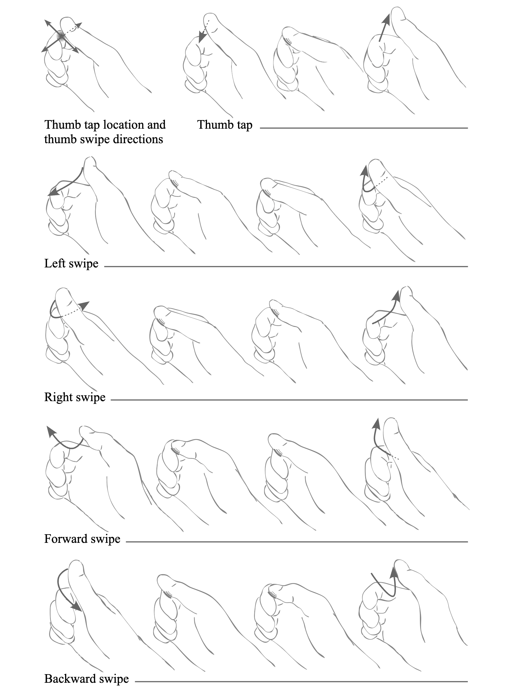

# OpenXR Hand Tracking Microgestures Sample

## Overview

Microgestures expand the capabilities of hand tracking by enabling low-calorie thumb tap and swipe motions to trigger discrete D-pad-like directional commands.

The hand pose and motion of the thumb is as follows: initially, the thumb must be raised above the index finger (not touching the index finger). The other fingers should be slightly curled as in the picture below for best performance: i.e. not too extended, nor completely curled into a fist.

A tap is performed by touching the middle segment of the index finger with the thumb, and then lifting the thumb.
The four directional thumb swipes performed on the surface of the index finger are:
1) Left swipe: a swipe towards the index fingertip on the right hand, and away from the index fingertip on the left hand. On the right hand for example, the motion is as follows: the thumb starts raised above the index finger, touches the middle segment of the index finger, slides towards the index fingertip, and lifts.
2) Right swipe: the same motion as the left swipe, but in the opposite direction. On the right hand for example, the thumb starts raised above the index finger, touches the middle segment of the index, slides away from the index fingertip, and lifts.
3) Forward swipe: the thumb starts raised above the index finger, touches the middle segment of the index finger, slides forward, and lifts.
4) Backward swipe: the thumb starts raised above the index finger, touches the middle segment of the index finger, slides backward/downward, and lifts.
Note that the motions can be performed at moderate to quick speeds, and should be performed in one smooth motion. The detection of the gesture happens at the end of the motion, regardless of speed.

## Using XrMicrogestures Native Sample App

As a user, when you open the sample app, the scene will contain the hand tracking overlay. There are 5 panels for each hand corresponding to:
* Swipe Left
* Swipe Right
* Swipe Forward
* Swipe Backward
* Tap Thumb

Each panel contains information about the OpenXR action state for the associated microgesture. The action state has the following data (for a complete description, please refer to the [Boolean Actions](https://registry.khronos.org/OpenXR/specs/1.0/html/xrspec.html#_boolean_actions) section in the OpenXR Specification).
* `currentState` ⎼ boolean value, set to `True` if a valid microgesture has been detected
* `isActive` ⎼ boolean value, set to `True` if the Microgesture extension is enabled
* `changedSinceLastSync` ⎼ boolean value, set to `True`, if the Microgesture state has changed sync the last sync call
* `lastChangeTime` ⎼ `XrTime` value, indicating the last time the state of the current gesture has changed
* `num events` ⎼ (not in the action state) integer value, indicating how many times the associated microgesture has been detected

## Link Support

Microgestures are supported over Link. Please refer to [Quest Link for App Development](https://developer.oculus.com/documentation/unity/unity-link/) for setup details.

The following software is required:
* Meta Quest build v71.0 or later
* Oculus PC app with version v71.0 or later, which you can download from the [Meta Quest website](https://www.meta.com/quest/setup/)
