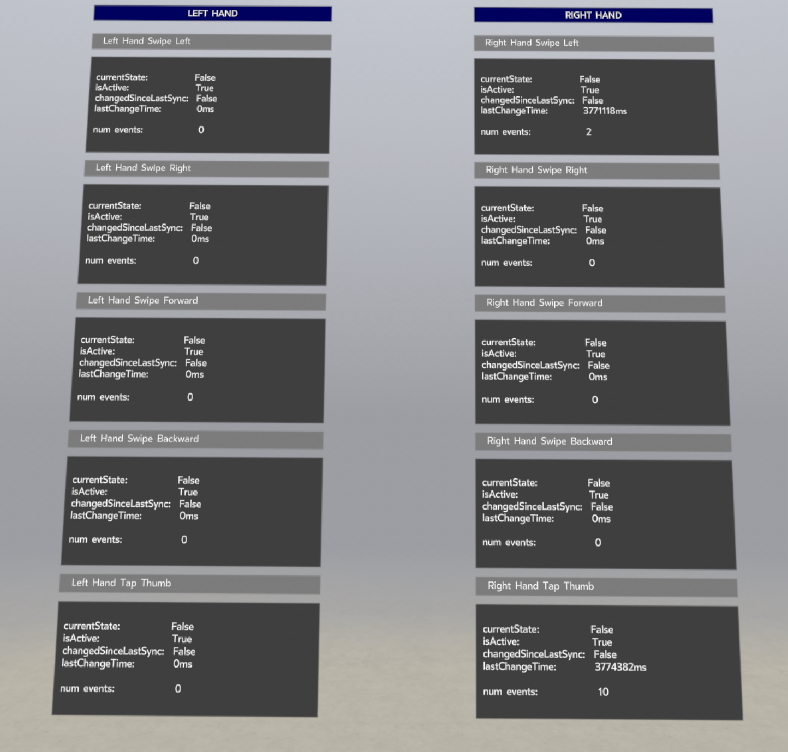

# OpenXR Hand Tracking Microgestures Sample

## Overview

Microgestures expand the capabilities of hand tracking by recognizing low-calorie thumb tap and thumb swipe motions performed on the side of the index finger. These gestures trigger discrete D-pad-like directional commands.

## Supported Devices
* Mobile
    * Quest 2
    * Quest 3
    * Quest Pro
* PC
    * Quest 2
    * Quest 3
    * Quest Pro

## XrMicrogestures Native Sample App

The hand tracking microgestures native sample app is a simple app that shows how to use the OpenXR API for microgestures.

## Building the sample app

Download the Oculus Mobile OpenXR SDK package (v74 or later) and then build the XRMicrogestures sample app with:
```bash
adb uninstall com.oculus.sdk.xrmicrogestures
cd XrSamples/XrMicrogestures/Projects/Android
../../../../gradlew installDebug
```

## Sample App Notes

As a user, when you open the sample app, the scene will contain the hand tracking overlay. There are five panels for each hand corresponding to:
* Swipe Left
* Swipe Right
* Swipe Forward
* Swipe Backward
* Tap Thumb

Each panel contains information about the OpenXR action state for the associated microgesture. The action state has the following data (for a complete description, please refer to the [Boolean Actions](https://registry.khronos.org/OpenXR/specs/1.0/html/xrspec.html#_boolean_actions) section in the OpenXR Specification).
* `currentState` ⎼ boolean value, set to `True` if a valid microgesture has been detected
* `isActive` ⎼ boolean value, set to `True` if the Microgesture extension is enabled
* `changedSinceLastSync` ⎼ boolean value, set to `True`, if the Microgesture state has changed sync the last sync call
* `lastChangeTime` ⎼ `XrTime` value, indicating the last time the state of the current gesture has changed
* `num events` ⎼ (not in the action state) integer value, indicating how many times the associated microgesture has been detected

When a microgesture action has been detected, the corresponding panel will turn green for a small duration. Note that this does not correspond to the duration that the action state is `True`, since that only lasts a few frames (and would be difficult to visualize).



#### main.cpp
Main logic of the sample. It handles responding to microgesture detections, setting up the scene, and demonstrates the real-time population of the action paths to help developers understand the behavior in real time.

#### SkyboxRenderer.h, SkyboxRenderer.cpp
Helper class to handle the rendering of the skybox.

#### EnvironmentRenderer.h, EnvironmentRenderer.cpp
Helper class to handle the rendering of the environment.

#### ActionSetDisplayPanel.h, ActionSetDisplayPanel.cpp
Helper class to handle the logic of displaying action set population UI for easy real-time understanding.
