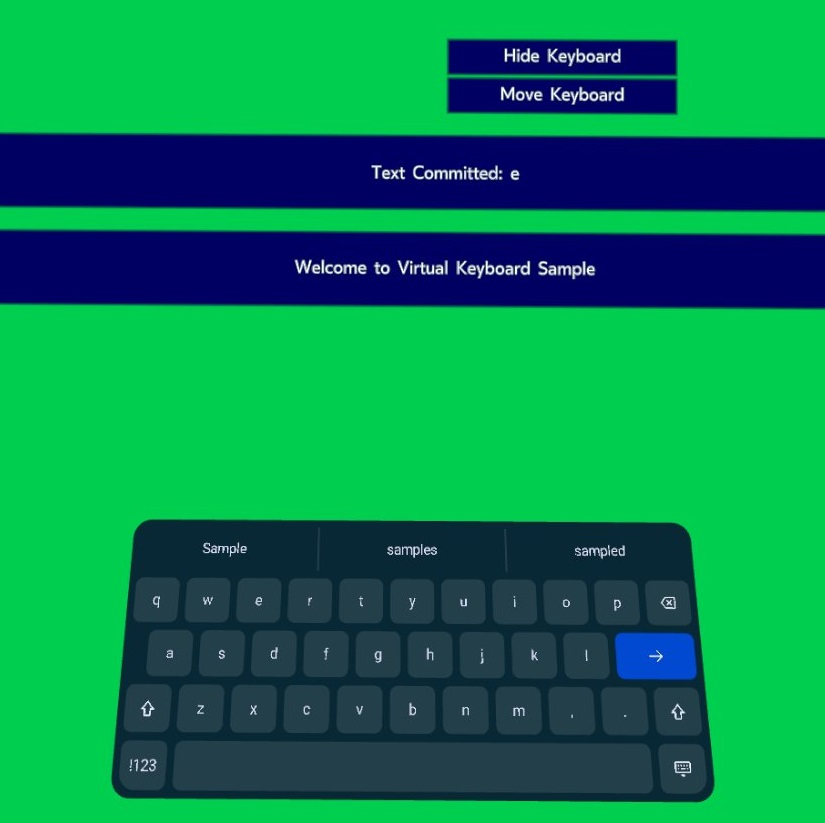
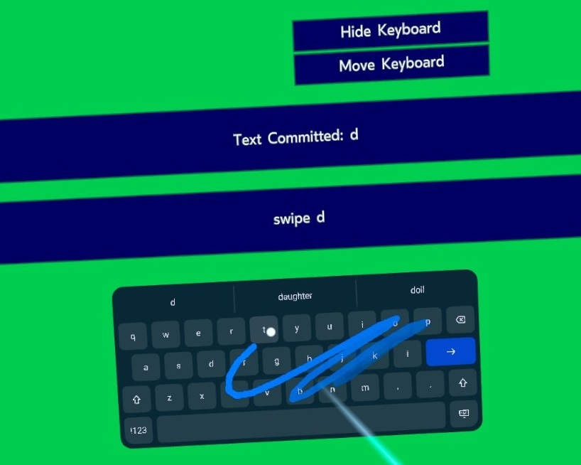

# Virtual Keyboard Sample Project

## Overview

Virtual Keyboard enables VR developers to easily integrate a best-in-class keyboard into their applications and provides users with a consistent typing experience across Meta Quest VR applications. The API is designed so that features and improvements can be made to the keyboard through OS updates, without any modifications by the developer to leverage the latest features.

The keyboard supports multiple input modes including far raycast based input, direct touch input, and swipe typing for both modalities.

While developers have full control over the position and scale of the keyboard, the extension provides default sizes and positions that have been fine-tuned for usability based on user research.

There are several components that you must set up to provide users with a rich text input experience. These components are:

* Virtual Keyboard
* Render Model
* Hands (optional)

The **Virtual Keyboard** is the main component that manages a keyboard in virtual space. This component allows the user to position and locate the keyboard, processes user interaction input, and provides visual and state updates back to the application.

The **Render Model** component provides the actual keyboard model to be rendered in virtual space. Note that while the application is running, new animation and texture data may be sent by the Virtual Keyboard runtime to reflect the current state of the keyboard model.

Though optional, we recommend enabling the **Hands** component as it assists in tracking and displaying hand models in virtual space that correspond to the user's actual hands, providing a more natural near field typing experience.

For the complete OpenXR API specification for Virtual Keyboard, please refer to [XR_META_virtual_keyboard](https://registry.khronos.org/OpenXR/specs/1.0/html/xrspec.html#XR_META_virtual_keyboard).

Additional information available on [Oculus Developers](https://developer.oculus.com/documentation/native/android/mobile-openxr-virtual-keyboard-overview/).

## Sample Notes

The sample project showcases different features of Virtual Keyboard including:

* Hands and Controllers interaction
* Near and Far field input (via raycast and touch)
* Keyboard positioning and scaling (via analog stick)
* Swipe typing and typeahead suggestions
* Touch limiting for improved feedback

Here is an overview of the contents of the sample:

#### main.cpp
The main entry point of the sample application. It contains the full definition of `XrVirtualKeyboardApp`, which derives from `OVRFW::XrApp` and implements all the app lifecycle methods. It also controls and manages the sample UI.

#### XrVirtualKeyboardHelper.h/cpp
Helper class for accessing the `XR_META_virtual_keyboard` extension API. It holds the handles to a Virtual Keyboard instance and the corresponding `XrSpace`.

#### XrRenderModelHelper.h/cpp
Helper class for accessing the `XR_FB_render_model` extension API. It manages the render model properties and provides functions to query the render model key and data.

#### XrHandHelper.h
Helper class for accessing the hand tracking extensions. It provides functionalities to using hands as input and manages the hand render model.

#### VirtualKeyboardModelRenderer.h/cpp
Helper class for rendering the Virtual Keyboard model. It keeps references to the dynamic textures and the loaded glTF model so we can apply the texture and animation updates returned by the runtime.
